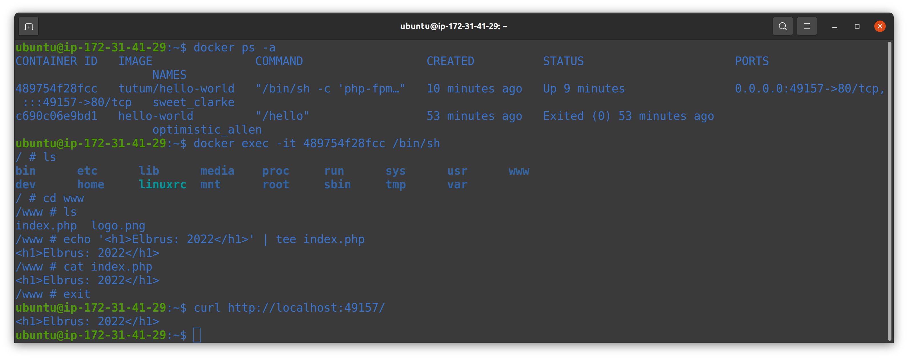

# Task 4:Docker

## Task 1

### 1. Firstly I created AWS EC2 Ubuntu instance and connected through ssh. I installed Docker Engine by using bash script.

### EXTRA 1.1 created install_docker.sh

<pre>
sudo apt-get update
sudo apt-get install \
    ca-certificates \
    curl \
    gnupg \
    lsb-release
sudo mkdir -p /etc/apt/keyrings
curl -fsSL https://download.docker.com/linux/ubuntu/gpg | sudo gpg --dearmor -o /etc/apt/keyrings/docker.gpg
echo \
  "deb [arch=$(dpkg --print-architecture) signed-by=/etc/apt/keyrings/docker.gpg] https://download.docker.com/linux/ubuntu \
  $(lsb_release -cs) stable" | sudo tee /etc/apt/sources.list.d/docker.list > /dev/null
sudo apt-get update
sudo apt-get install docker-ce docker-ce-cli containerd.io docker-compose-plugin
</pre>

## Task 2

### 2. I downloaded and ran docker container "Hello World" by using below commands:
<pre>
docker pull hello-world
docker run hello-world
</pre>

###  In order to don't run docker commands with sudo I used the following command:

<pre>
sudo usermod -aG docker
</pre>

### Commands & parameters

### Containers

#### Lifecycle

- `docker create` creates a container but does not start it.
- `docker rename` allows the container to be renamed.
- `docker run` creates and starts a container in one operation.
- `docker rm` deletes a container.
- `docker update` updates a container's resource limits.

#### Starting and Stopping

- `docker start` starts a container so it is running.
- `docker stop` stops a running container.
- `docker restart` stops and starts a container.
- `docker pause` pauses a running container, "freezing" it in place.
- `docker unpause` will unpause a running container.
- `docker wait` blocks until running container stops.
- `docker kill` sends a SIGKILL to a running container.
- `docker attach` will connect to a running container.

#### Info

- `docker ps` shows running containers.
- `docker logs` gets logs from container.
- `docker inspect` looks at all the info on a container (including IP address).
- `docker events` gets events from container.
- `docker port` shows public facing port of container.
- `docker top` shows running processes in container.
- `docker stats` shows containers' resource usage statistics.
- `docker diff` shows changed files in the container's FS.

#### Import/Export

- `docker cp` copies files or folders between a container and the local filesystem.
- `docker export` turns container filesystem into tarball archive stream to STDOUT.

#### Executing Commands

- `docker exec` to execute a command in container. Use: `docker exec -it foo /bin/bash`

### Images

#### Lifecycle

- `docker images` shows all images.
- `docker import` creates an image from a tarball.
- `docker build` creates image from Dockerfile.
- `docker commit` creates image from a container, pausing it temporarily if it is running.
- `docker rmi` removes an image.
- `docker load` loads an image from a tar archive as STDIN
- `docker save` saves an image to a tar archive stream to STDOUT with all parent layers

#### Info

- `docker history` shows history of image.
- `docker tag` tags an image to a name (local or registry).

#### Load/Save

Load an image from file:

- `docker load < my_image.tar.gz`

Save an existing image:

- `docker save my_image:my_tag | gzip > my_image.tar.gz`

#### Import/Export container

Import a container as an image from file:

- `cat my_container.tar.gz | docker import - my_image:my_tag`
  
#### Export an existing container:

- `docker export my_container | gzip > my_container.tar.gz`

### EXTRA 2.1 I downloaded docker image with html page and edited it

<pre>
docker pull tutum/hello-world
docker run -d -p 80 tutum/hello-world
docker ps -a
</pre>

<pre>
docker ps -a
docker exec -it 489754f28fcc /bin/sh
echo "html tag" | tee /www/index.php
curl http://localhost:49157/
</pre>

### 3.1 I created Docker file for building docker image an ran it.

[Docker-File](/docker_files/Dockerfile)

<pre>
FROM ubuntu:20.04

RUN apt-get -y update
RUN apt-get -y install apache2

RUN echo "Hello Docker!' > /var/www/html/index.html

CMD ["/usr/sbin/apache2ctl", "-D" "FOREGROUND"]
EXPOSE 80
</pre>

<pre>
docker build -t uvaysjon:v1 .
</pre>

<pre>
docker run -d -p 7777:80 uvaysjon:v1 
curl http://localhost:7777
</pre>

## Task 3

### EXTRA 3.1.1 For creating docker image I used clear basic image (ubuntu)

<pre>
FROM ubuntu:20.04
</pre>

### 3.2 I've modified Dockerfile by adding environment variable and build a new image extra_task:v1:

[Extra-Docker-File](/docker_files/extra_Dockerfile)

<pre>
FROM ubuntu:20.04
ENV DEVOPS="Uvaysjon"
RUN apt-get -y update
RUN apt-get -y install apache2

RUN echo "Environment variable:" $DEVOPS > /var/www/html/index.html

CMD ["/usr/sbin/apache2ctl", "-D" "FOREGROUND"]
EXPOSE 80
</pre>

### EXTRA 3.2.1 I printed environment variable with the value on a web page. Also changed the value after restart of the docker.

### Task 4

### 4.1 I pushed docker image to docker hub and wrote description

#### Firtstly I've login to my previously created docker hub

#### And used below commands to tag and psuh docker image:

<pre>
docker tag extra_task:v1 uzcoder/extra_task
docker push uzcoder/extra_task
</pre>

### 4.2 I wrote github action to integrate my docker image, my github repository and create an automatic deployment for each push.

### ci.yml

<pre>

name: Build and Publish

on:
  push:
    branches: [master]

jobs:

  build-and-push-docker-image:
    name: Build Docker image and push to repositories
    runs-on: ubuntu-latest

    steps:
      - name: Checkout code
        uses: actions/checkout@v2

      - name: Set up Docker Buildx
        id: buildx
        uses: docker/setup-buildx-action@v1

      - name: Login to DockerHub
        uses: docker/login-action@v1
        with:
          username: ${{ secrets.DOCKERHUB_USERNAME }}
          password: ${{ secrets.DOCKERHUB_TOKEN }}

      - name: Login to Github Packages
        uses: docker/login-action@v1
        with:
          registry: ghcr.io
          username: ${{ github.actor }}
          password: ${{ secrets.GHCR_PAT }}
      
      - name: Build image and push to Docker Hub and GitHub Container Registry
        uses: docker/build-push-action@v2
        with:
          context: ./Task4/docker/extra
          tags: |
            elbrus/exadel_practices:latest 
            ghcr.io/kh-elbrus/exadel_practices/docker-extra-app:latest
          push: ${{ github.ref == 'refs/heads/master' }}

      - name: Image digest
        run: echo ${{ steps.docker_build.outputs.digest }}
</pre>

